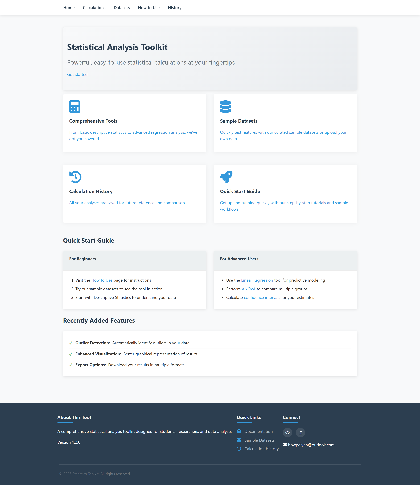

# Statistics Toolkit

A comprehensive web application for performing various statistical calculations with an intuitive interface.

## Features

- **Descriptive Statistics**: Calculate mean, median, mode, range, variance, standard deviation, quartiles, and identify outliers
- **Normal Distribution**: Compute probabilities for normal distributions with given parameters
- **ANOVA**: Perform analysis of variance between groups
- **Confidence Intervals**: Calculate different types of confidence intervals
- **Linear Regression**: Perform simple linear regression analysis
- **Sample Datasets**: Access pre-loaded datasets for quick testing
- **Calculation History**: View and revisit previous calculations

## Usage

1. **Navigation**:
   - Use the top menu to access different calculation types
   - Dropdown menus provide access to specific tools

2. **Performing Calculations**:
   - Enter your data in comma-separated format
   - Use sample datasets for quick testing
   - Click "Calculate" to see results

3. **Viewing History**:
   - All calculations are saved automatically
   - Access previous results from the History page
  
## Installation

1. Clone the repository:
   ```bash
   git clone https://github.com/peiyan0/statistics-toolkit.git
   cd statistics-toolkit
   ```

2. Create and activate a virtual environment:
   ```bash
   python -m venv venv
   source venv/bin/activate  # On Windows use `venv\Scripts\activate`
   ```

3. Install dependencies:
   ```bash
   pip install -r requirements.txt
   ```

4. Initialize the database:
   ```bash
   cd dataset
   python script.py
   ```

5. Run the application:
   ```bash
   flask run
   ```

6. Open your browser to:
   ```
   http://localhost:5000
   ```

## Requirements

- Python 3.8+
- Flask
- SQLite (for database)

## Project Structure

```
statistics-toolkit/
├── blueprints/              # Flask blueprints
│   ├── descriptive.py       # Descriptive statistics routes
│   ├── linear.py            # Linear regression routes
│   └── ...                  # Other calculation modules
├── static/                  # Static files
│   ├── css/                 # Stylesheets
├── templates/               # HTML templates
│   ├── calculations/        # Calculation pages
│   └── base.html            # Base template
├── dataset/                 # Sample datasets
│   └── dataset.db           # SQLite database
│   └── script.py            # Script to insert datasets
├── statisticss/             # Statistical functions
│   ├── descriptive.py       # Descriptive stats functions
│   └── ...                  # Other statistical modules
├── requirements.txt         # Python dependencies
└── app.py                   # Main application entry point
```
  

